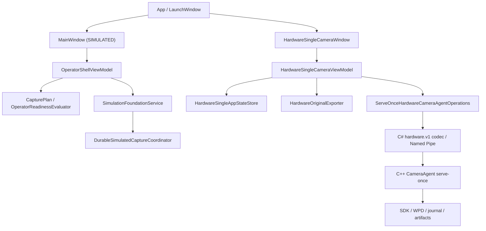
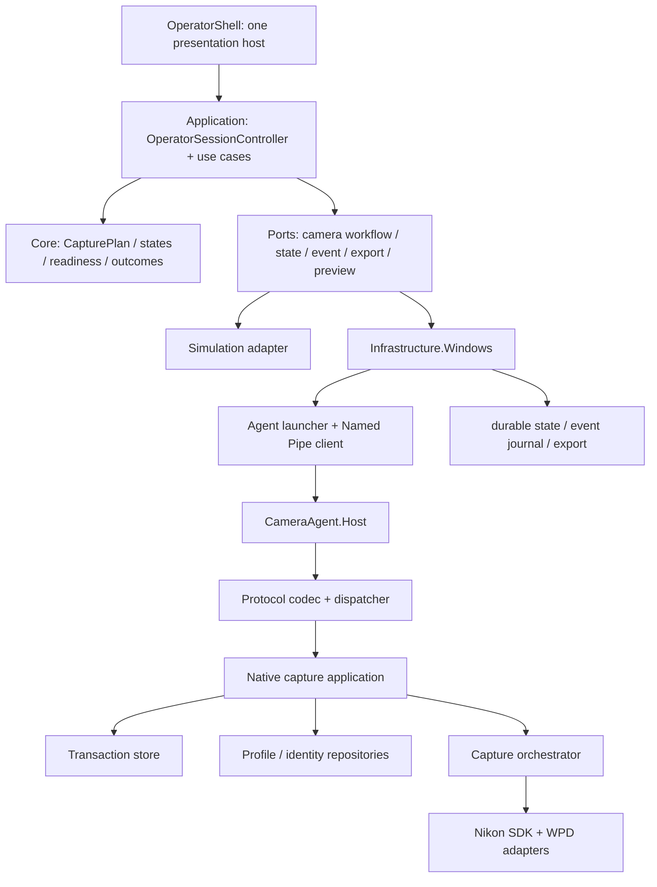

# アプリ構成レビューと実装計画

状態: Proposed / 2026-08-10

対象: 現行worktree（branch `codex/d810-phase0-roadmap-safety`、baseline HEAD `1c8233c`）

目的: 現在のSingleCamera software boundaryを壊さず、SingleCamera／DualCamera統合製品へ段階移行する。

この文書は構成レビューと実装順序を定める。製品要件やhuman gateの数値を新しく決定するものではなく、実D810操作、撮影設定write、カード削除、実画像取得も行わない。

## 実装担当モデルの固定

ユーザー指定により、各work packageの製品コード実装担当は、モデル名を厳密に`GPT-5.6 Luna`、推論力を`Ultra`とする。

- 実装開始前にorchestrator上でこの正確なモデルが選択可能か確認する。
- 選択できない場合は、別モデルへ自動置換せず、コード変更前に停止してユーザーへ判断を求める。
- 計画・監査・独立verificationは実装担当と分離する。
- 一つのwork packageにプロトコル変更、状態migration、UI統合、native refactorを混在させない。

## 1. 総合判定

現行実装は、安全なSingleCamera software boundaryとしては強い。transactionの事前永続化、no retry、同一ID recovery、exact-count、profile相関、SDK/WPD非重複、canonical original検証、明示exportなど、維持すべき境界が契約試験で固定されている。

一方、製品アプリの長期構造としてはPartialである。主な理由は次のとおり。

1. simulated Single/Dualとhardware Singleが、別Window・別ViewModel・別状態機械で動く。
2. 共通に見えるdomain型がsimulation固有stateへ依存し、hardware経路は共通readiness evaluatorを使わない。
3. WPF側に、exportやoperator errorを含む永続的なredacted event journalがない。
4. C#とC++のhardware v1 wireが大きな手書きcodecで二重管理され、製品binary間のcross-language試験がない。
5. C++ Camera Agent、C# protocol、二つのViewModel、test harnessが肥大化し、責務境界が不明瞭になっている。
6. 現行planは、実装済みSingle software boundaryと未実装Dual hardware pathを同じM3直列レーンとして扱い、stateと不整合である。
7. CI、install layout、binary compatibility、upgrade、rollback、support recoveryの製品化計画が不足している。

結論として、既存のhardware v1とSingle画面を直ちに置換しない。最初に共通domain、event schema、contract corpus、継続検証を追加し、その上へapplication use-caseと共通UIを移すstrangler方式を採用する。

## 2. 現行構成



重要な観察:

- `ApplicationLaunchMode`は`Launcher / Simulated / HardwareSingle`であり、「実行環境」と「製品mode」を一つのenumへ混在させている。
- simulated側だけが明示`CapturePlan`と`OperatorReadinessEvaluator`を使う。hardware Single側は独自のgateと状態遷移を持つ。
- `CaptureOutcome`は共通配置だが`SimulatedTransactionState`へ依存する。
- `HardwareSingleCameraViewModel.cs`は約1,076行、`OperatorShellViewModel.cs`は約803行で、表示、use-case、IO、timer、error整形が混在する。
- `HardwareCameraAgentProtocol.cs`は約1,799行、`hardware_camera_agent.cpp`は約3,362行で、DTO、codec、validation、journal、path safety、profile、orchestrationの変更理由が重なる。
- .NET testsは自己完結型で安全な決定的caseを持つが、巨大なconsole `Program.cs`で、実Window、binding、STA、keyboard/focus、screen readerを実行しない。
- SDK-lessとlicensed-SDK-enabledのnative Agent contractを別build directoryから同時実行すると、test内の固定transaction lease名が競合し、一方が`0xc0000409`で終了する。単独実行は合格するため製品経路のfailureではないが、test isolationまたは実行時serializationが必要である。

## 3. 維持する非交渉条件

構成改善中も次を弱めない。

- modeはactive transaction外で明示し、接続台数から推定しない。
- DualCamera不足時にSingleCameraへ自動降格しない。
- SingleCameraは初期仕様でSDK/WPD双方exactly-one physical D810を要求する。
- 実SDK/WPD commandはinteractive Windows logon session全体のoperator-session leaseを保持する。別user sessionまたはserviceからのcamera controlはMVP運用外とする。
- SDKとWPD sessionを重複させず、一transactionと一SDK camera sessionだけを許可する。
- camera settingsは承認profileとのread-only照合だけを許可し、製品アプリからwriteしない。
- capture requestはcamera access前にclient transaction ID、mode、required alias、profile snapshot、handoff intentを永続化する。
- 応答不明・crash・再起動時は同一transactionを照会し、captureを自動再送しない。
- 180秒watchdog、no retry、ambiguous resultの自動採用禁止を維持する。deadline後はsafe close以外の次transport、canonical rename、camera delete、success遷移を開始せず、既存`.partial`またはcanonical originalを診断用に保持する。
- canonical PC originalを検証して保持する前にcamera objectを削除しない。
- spoolはcapture前後ともpayload 0を確認し、canonical originalのwrite、JPEG/size/SHA、atomic rename、reread後にexact just-recovered object一件だけを削除する。bulk delete、card format、vendor operation `0x9207`は禁止する。
- DualCameraはCAM-A→CAM-Bの順次撮影であり、実shutter synchronizationを保証しない。
- Live View previewをoriginalまたはstitch inputへ昇格しない。
- hardware v1 wireと既存pending journalは、migration完了まで読取・recovery互換を維持する。
- architecture refactorの試験では実camera commandを送らない。

## 4. 改善項目と優先度

| 優先 | 改善項目 | 現在の影響 | 改善方向 |
|---|---|---|---|
| P0 | Single hardwareとsimulated Single/Dualの状態機械統合 | 同じ要件が二つのViewModelで別実装となり、Dual追加時に三系統へ増える | neutral domainとapplication use-caseを作り、simulation/hardwareをadapter化する |
| P0 | OperatorEventJournal | pending snapshot以外のlaunch、readiness、export、operator errorがdurableに相関されない | bounded、redacted、append-only journalをtransaction/request IDでAgent journalと相関する |
| P0 | plan/state/requirement traceability | 実装済みSingle boundaryがwaitingのまま、release work itemのrequirement refsも不完全 | M3 Common／Single／Dualレーンへ再編し、requirement→test→evidence manifestを追加する |
| P0 | software-only CIとcross-language contract | green evidenceがローカル手順依存で、C#／C++ driftを製品process間で検出できない | Windows CI、shared golden corpus、no-camera product binary smokeを追加する |
| P0 | 製品stagingとruntime SDK解決 | configure時SDK module絶対pathがnative binaryへ入り、WPF/Agentのinstall規則がない | 開発CLIと製品Agentを別componentにし、承認済みruntime manifestからSDKを検証・解決する |
| P1 | ViewModelとcomposition rootの分離 | Window constructorがstorage/process/exporterを構築し、ViewModelがIOとorchestrationを持つ | manual composition root、use-case service、immutable presentation stateへ分割する |
| P1 | hardware v1 APIの整理 | 安全に使えない旧overload、巨大command codec、内部の`resume`誤名称が残る | v1互換のままcommand別codec/validatorへ分割し、必須correlation contextだけを公開する |
| P1 | C++ Camera Agentの責務分割 | 一変更がprotocol、journal、profile、capture orchestrationへ波及する | protocol、profile、transaction store、artifact store、orchestrator、pipe hostを別target/fileへ分ける |
| P1 | 実行環境と製品modeの分離 | `Simulated`と`HardwareSingle`が同じ起動mode軸に入り、HardwareDual追加点がない | `ExecutionEnvironment`と`CameraOperatingMode`を別型にし、capability catalogでavailability理由を示す |
| P1 | state/profile/binary compatibility | unsupported stateは安全にblockするが、upgrade時のlegacy pending recoveryとagent版照合がない | lossless migration registry、quarantine、install manifest、agent hash/version検証を追加する |
| P1 | Live View契約の確定 | hardware v1は有限probeで、要件上の対話的開始・停止・撮影後再開とは一致しない | 有限probeへ要件を変更するか、bounded sessionを実装するかhuman decisionを取得する |
| P2 | test/UX/operations | custom runner、実Window試験なし、installer/diagnostic/retention不足 | filtered runnerまたは公式platform、WPF STA/accessibility試験、support/packaging laneを追加する |

## 5. 目標構成



推奨.NET project境界:

1. `A0CameraStitcher.Core`: platform非依存のmode、plan、state、readiness、outcome。
2. `A0CameraStitcher.Application`: use-case、ports、state reducer。WPF、filesystem、Process、Named Pipeへ依存しない。
3. `A0CameraStitcher.Contracts`: versioned hardware protocol DTOとshared contract fixtures。
4. `A0CameraStitcher.Infrastructure.Windows`: agent launcher、pipe、local durable IO、session lease、verified export。
5. `A0CameraStitcher.Simulation`: fake workflowとdiagnostic scenario。
6. `A0CameraStitcher.OperatorShell`: XAML、presentation state、compositionのみ。

最初から全assemblyへ物理分割しない。先にnamespaceとdependency testで境界を作り、循環がないことを確認してからprojectへ移す。

## 6. 実装work package

### AR-00: Baselineと計画整合

優先: P0 / 既存WI: M3P、WI-0030〜0035、WI-0041〜0042

- 現在のSingleCamera変更を独立review済みcheckpointとして確定する。
- `.autodev/plan.json`をM3 Common、M3 Single、M3 Dualへ分け、実装済みsoftware boundaryとhardware acceptanceを別work itemにする。
- `WI-0035`とrelease gateを32要件へ双方向traceし、`FR-LV-001/002`を含める。
- `HG-0009`を、profile/画像契約を決めるAと、p95/耐久基準を決めるBへ分ける提案をhuman reviewへ出す。`HG-0009A/B`は現時点では提案ラベルであり正本gateではない。human承認後にrequirements normalized、unresolved/open-gates、plan/stateへ同期するまで下流は現行`HG-0009`でblockする。

完了証拠:

- clean checkpoint、機密・実画像・licensed binary混入0。
- plan graphにcycle 0、plan/state/evidenceのversionとstatus一致。
- HG-0009 splitを採用する場合はhuman decision IDと全仕様正本のA/B gate同期が完了し、不採用なら下流依存を現行HG-0009へ戻す。
- requirement→work package→test ID→environment→evidence artifactのmanifestが32件を一意に辿れる。

### AR-01: Contract corpus、toolchain固定、CI

優先: P0 / 依存: AR-00

- hardware v1のcross-language所有境界であるwire request/responseだけを、言語中立JSON golden corpusとしてC#とC++で共有する。
- native-privateなAgent journal/profileはC++専用corpus、WPF app-stateはC#専用corpusに分ける。unknown、duplicate、mismatch、expiry、terminal historical queryの期待結果はtrace manifestで対応付けるが、別ownerのparserを共有しない。
- production Camera Agentをcamera非接続の`get-transaction-result` NotFoundだけで起動するcross-process smokeを追加する。
- 実.NET production launcher/clientから実SDK-less Agentへ完全なcapture requestを送り、camera access前に安全にBlockedとなる条件でclientを切断する。childがterminal journalをcommitして終了し、別Agent processの同一ID queryで結果を返し、capture replay 0となるblack-box試験を追加する。
- partial frame、pre-connect cancel、child early exit、non-zero exit、bounded stderr、GUID pipe、current-user ACL、`FIRST_PIPE_INSTANCE`、responseとchild exit双方の確認をprocess integration試験へ含める。
- production binaryへfake switchを追加しない。追加success/failure形はproduction dispatcher/journalをlinkしたtest-only hostとfake transportで検証し、製品Agentではprofile未承認のtyped `SingleNotReady`を確認する。
- `global.json`、`CMakePresets.json`、共通software contract scriptを追加する。
- GitHub Windows laneで.NET Release、SDK-less CMake/CTest、plan/evidence整合、機密・実画像・SDK binary混入検査を行う。
- licensed SDK compileは承認済みself-hosted laneでcamera commandなしに限定する。
- productと同じlease namespaceを使うnative suiteはCTest `RESOURCE_LOCK`／CI dependencyで明示直列化する。独立性だけを見るtestはtest-only namespaceをprocessごとに一意化できるが、別途、同一namespaceの二process排他試験を残す。

完了証拠:

- clean runnerで再現可能な保存済み結果。
- C#／C++ corpus結果が同一。
- product binary smoke中のSDK/WPD open、capture、deleteが0。
- request後disconnect試験でterminal commit 1、同一ID query成功、capture replay 0。
- 並列可と宣言したsuiteは二variant同時実行で安定し、直列指定したsuiteはCI定義がその制約を検査する。

### AR-02: Neutral domainとOperatorEvent schema

優先: P0 / 依存: AR-01

1. `AR-02a Domain/event schema`: `CameraOperatingMode`、`CapturePlan`、profile snapshot、transaction state、capture/stitch/export outcomeをsimulation名から切り離す。`ExecutionEnvironment`をmodeと別型にし、`StitchOutcome`を`NotApplicable / Pending / Succeeded / Failed`、app stateを`KnownUndispatched / DispatchedUnknown / Reserved / InProgress / terminal`としてtypedにする。bounded、redactedな`OperatorEvent` schemaを定義する。
2. `AR-02b Durable event store`: AR-02aとは別commitで、Windows fixed-local、append-only、crash-durableなstoreを実装する。transaction/request IDでAgent journalへ相関し、bounded record size、strict schema、rotation、retention boundary、quarantineを持たせる。

記録対象はlaunch/session初期化、environment/mode/alias/profile freeze、readiness、preview/handoff、capture dispatch/query/terminal、stitch/restitch、export、operator error、migration/quarantineとする。camera serial、credential、original/preview bytes、unredacted pathは記録しない。

完了証拠:

- CoreからWPF、IO、Process、Named Pipe、simulation implementationへの参照0。
- 同じdomain contractをSimulationとHardwareSingle adapter fixtureへ適用。
- required event全種がAgent transaction IDへ一意に相関し、crash後も順序とterminal有無を再構成できる。
- critical event永続化失敗のpre-dispatchはcamera call 0、post-dispatchはretry 0でpending維持。
- oversize、duplicate、partial write、rotation boundary、retention failureはfail-closedで、別transactionのeventを失わない。

### AR-03: Application use-caseとmigration

優先: P0 / 依存: AR-02

1. `AR-03a Application use cases`: `InitializeSession`、`CheckReadiness`、`StartPreview`、`Capture`、`Recover`、`Export`、`PrepareNext`をWPF外へ抽出する。immutable session stateとpure reducerでcommand availabilityを決め、各state transitionと外部operationをAR-02bへ記録する。
2. `AR-03b State migration`: AR-03aとは別commitで、hardware app-state v2とagent v1 journalのlegacy reader／migration registryを追加する。migration不能stateはread-only quarantineし、dispatch済み曖昧transactionをclearしない。

完了証拠:

- use-case contract testsがWPFなしでSimulation/HardwareSingleの共通scenarioを通す。
- 全use-caseのsuccess、blocked、failed、cancelled、recovery pathがrequired OperatorEventを一回だけ記録し、Agent journalとの相関不一致を拒否する。
- crash pointごとにrestart後のcapture call 0、同一ID queryだけを確認。
- 旧state、破損state、upgrade、downgradeのfixture結果がfail-closed。

### AR-04: Composition rootと共通OperatorShell

優先: P1 / 依存: AR-03

- `App`にmanual composition rootとcapability catalogを置き、Window constructorからservice構築を除く。
- 一つのOperatorShellへ共通session presentationを置く。
- Simulationは診断環境、Single/Dualは製品modeとして別軸表示する。
- HardwareDualは必要gateが閉じている間、理由付きdisabledにし、自動fallbackしない。
- ViewModelをpresentation stateとcommand委譲へ限定する。

完了証拠:

- launcher/simulationではhardware lease取得0。
- active/pending中のenvironment、mode、alias変更0。
- Singleでは一alias／stitch N/A、Dual simulationではA→B／stitchが同じshellで成立。
- WPF STA smoke、binding error 0、keyboard-only、focus、live region、screen-reader walkthrough。

### AR-05: hardware v1とC++ Agentの非機能refactor

優先: P1 / 依存: AR-01。AR-02〜04と並行可。

AR-05は一括実装しない。次を独立sub-package、独立characterization、rollback可能なcommitとして順番に実施する。各sub-packageでv1 wireとjournalのbyte互換、legacy pending recovery、camera command 0を再検査する。

1. `AR-05a C# surface`: v1 wireのfield、result code、strictnessを変更せず、C# codecをcommand別DTO/validatorへ分割する。correlation contextなしの公開capture/query overloadは互換期間中に削除せず、camera requestを送らないfail-closed shimと`Obsolete` warningにする。削除はmajor/version gateとcaller 0 evidenceを別途承認した後だけ行う。
2. `AR-05b Native protocol`: C++のframing、strict parser、DTO、dispatcher validationをcapture orchestrationから分離する。
3. `AR-05c Transaction store`: journal、reservation、typed transition table、same-ID queryを分離し、client transaction IDをcore executorまで伝播する。alias別処理は`captureLegId`として相関する。transaction mutexは予約開始からterminal commitまで、global camera leaseは`InProgress`からterminal commitまで保持する。
4. `AR-05d Repositories`: profile/identity/artifact store、path guard、canonical original lifecycleを分離する。検証済みcanonical originalのwrite/delete-deny handleはexact WPD cleanup完了まで保持する。
5. `AR-05e Orchestrator ports`: 具象`NikonSdkTransport`／`WpdTransport`生成をtransport factory portへ移し、orchestratorをfake transportで直接検証する。production config内のtest callbackをinterface seamへ移す。
6. `AR-05f Host/config/staging`: pipe host、CMake target、UTF-16 versioned manifest、launcherを分離する。launcherはpipe connectとchild exitをraceし、dispatch前exitではbounded stderrをtyped launch errorとして返す。CameraAgentは必要最小限だけlinkする。

`AR-05f`ではSDK-less contract-test Agentとlicensed-adapter product Agentを別target/capabilityにする。product manifestへcompile-time adapter capability、source/build provenance、target architecture、Agent/protocol versionを固定し、licensed adapterがないbuildからproduct packageを生成した場合はfailさせる。camera非接続の`--describe-build`相当のcapability queryはSDK module load 0で、このmanifestとbinaryを照合する。

configure時のSDK絶対path埋込みを廃止し、承認済み固定ローカルruntime manifestからbitness、module hash、必要DLLを検証して解決する。manifestのtrust anchorは署名済みpackageまたはpackageへ固定したhashとする。manifest/module/DLLはUNC、device path、ADS、removable drive、reparse pointを拒否し、全ancestorがfixed-local、regular fileであることを確認する。hash検証した同一file identityを保持したままrestricted DLL searchでloadし、pathの再解決によるTOCTOUを許さない。minimal product stagingをAR-06より前に成立させる。

`get-transaction-result`は現在のSDK/profile/identityが欠落、期限切れ、破損、改竄のいずれでも、それらをloadせずhistorical journal snapshotだけで照会できなければならない。互換性はv1 wire、native journal、.NET public API、argv/exit semanticsを別々のfixtureで固定する。

内部の`live_view_resumed`等は有限post-capture probeの正しい名称へ変更するが、v1 wire名は維持する。

完了証拠:

- existing SDK-less／licensed-SDK-enabled CTest全合格。
- golden corpusとcross-process smoke全合格。
- v1 binary compatibility fixtureとlegacy pending recovery全合格。
- SDK/profile/identityを利用できない状態でもhistorical terminal queryが成功し、新規camera accessは0。
- minimal stagingを別の固定ローカルdirectoryへ移しても追加開発引数なしで起動し、manifest不正はcamera access前にfail-closed。
- SDK-less targetからproduct package生成0。licensed product Agentのbuild capability/provenance照合が一致し、no-camera capability query中のSDK module load 0。
- camera command 0のrefactor evidence。

### AR-06: SingleCamera product integration lane

優先: P1

1. `AR-06a Software integration` / 依存: AR-03、AR-04、AR-05f、明示的なM1A再開、現行HG-0009のprofile/画像契約decision。AR-00でsplitが正式承認された場合だけ、このdecisionを`HG-0009A`と呼ぶ。
2. `AR-06b Hardware acceptance` / 依存: AR-06a、M1Aのone-shot・10/10・handoff・fault/recovery transport evidence完了、現行HG-0009のp95/耐久decision。split承認後だけ`HG-0009B`と呼ぶ。

- approved Single profile repositoryとread-only import/selectionを実装する。値を自動生成しない。
- approved Single profileに対し、selected identity/settings、画角、coverage/crop、承認済み品質条件を評価するSingle setup assessmentをapplication/UIへ接続する。draft、期限切れ、alias不一致、未承認条件はfail-closedとし、overlap、seam、inter-camera relative correctionは明示`NotApplicable`にする。
- app→Agent→exactly-one D810→canonical original→明示exportを共通use-caseへ接続する。
- one-shot、反復、disconnect、software restart、ambiguous responseを受入する。
- 物理power-cycle/reboot項目は既存human decisionどおりN/Aを維持する。

完了証拠:

- actual JPEGのsource/export sizeとSHA-256一致。
- approved profileを使う実画像でidentity/settings/coverage/crop/Single品質判定を記録し、draft/expiry/mismatchはcapture前block。overlap/seam/inter-camera correctionは実行0かつ`NotApplicable`。
- stitch job 0、非選択alias operation 0、retry 0。
- camera setting write 0、bulk delete 0、format 0、vendor operation `0x9207` 0。camera deleteはexact just-recovered objectだけで、spool empty-before/afterを記録する。
- HG-0009の承認済みperformance/durability decisionが定めたp95・耐久run数とfailure 0基準。

### AR-07: Live View製品契約

優先: P1。次のsublaneを別statusにする。

1. `AR-07a Common decision/contract` / 依存: AR-03、AR-04、AR-05。有限probeへ要件変更する場合だけ追加human decisionを要求する。
2. `AR-07b Single integration/acceptance` / 依存: AR-07a、M1A handoff evidence。
3. `AR-07c Dual integration/acceptance` / 依存: AR-07a、M1B identity binding、HG-0003B、AR-08b Native pair、AR-08c Application/recovery。

現行`FR-LV-001/002`は対話的start/frame/stopと撮影成功後の再開を要求するため、既定経路はbounded Live View sessionの実装である。Agentがstart/frame/stop、max lifetime、backpressure、crash close、capture handoffを所有する。

MVPを明示的な有限preview probeへ変更する案は要件変更である。product ownerが新しいhuman decision／unresolved gateを承認し、`PRODUCT_REQUIREMENTS.md`、normalized requirements、plan、verification、acceptanceを同期し終えた場合に限り選択できる。現状の有限probeをgreen evidenceとして継続sessionへ読み替えない。

bounded sessionはhardware v1へoperationを追加しない。別のversioned v2 schemaとcapability markerを定義し、session ID、ownership token、selected alias、frame sequence、長寿命childのowner、heartbeat、max lifetime、backpressure、disconnect/crash時のorphan cleanupを契約化する。現行のper-operation `serve-once` childはSDK sessionを保持できないため流用せず、同一global leaseを所有するsession process内でSDK stop/full-closeからcaptureへrace-freeに引き渡す。

継続sessionでも、capture前のSDK stop/full close確認、WPD baseline、SDK capture、WPD recovery後だけの再開、preview非原本を維持する。

完了証拠:

- schema negotiation、session ID相関、start/frame/stop、heartbeat timeout、backpressure、stop failure、同一owner内capture handoff、post-capture再開failureのdeterministic試験。
- Single selected alias、Dual CAM-A選択、Dual CAM-B選択を別々に受入し、同時Live View session 0、SDK/WPD overlap 0、orphan session 0、capture後の再開／再開failureをmode別に記録する。
- 実機10 handoff。Dualではstable binding前のhandoff 0、shutter synchronization保証なし。

### AR-08: DualCamera hardware transaction v2

優先: P1 / 依存: AR-02〜05、M1B、M2、HG-0001、HG-0002

AR-08も一括実装しない。v1をSingle legacy recoveryのため残し、次の独立sub-packageへ分ける。

1. `AR-08a v2 contract/store`: versioned v2 `capture-transaction` wire、capability negotiation、pair journal、same-ID queryだけを定義する。requestはclient transaction ID、mode、ordered required aliases、alias別profile ID/version/hash/expiry、期待設定、identity applicabilityを固定する。
2. `AR-08b Native pair orchestrator`: Agentがpair transaction全体を所有し、CAM-A→CAM-B、no retry、current interactive session内のexactly-two/current binding revalidationを実装する。180秒absolute deadlineはreservation開始前からpair terminal commitまで一つだけとし、各legのWPD baseline/recovery直前とSDK capture-session open直後にexactly-twoとbindingを再検証する。
3. `AR-08c Application/recovery`: v2 adapter、restart recovery、common use-case、operator event correlationを接続する。
4. `AR-08d Stitch/quality`: setup assessment、stitch、restitch、quality outcomeをapplication layerへ接続する。native capture protocolと同じcommitに混在させない。
5. `AR-08e Hardware acceptance`: disconnect/restart、same-ID query、fault matrix、pair quality、performance、durabilityを実機で判定する。

各sub-packageは独立commitとし、A完了後B失敗時もA originalを保持する。hardware v1へDual条件分岐を追加しない。

完了証拠:

- software contractでclient disconnect/restart後の同一ID query、capture replay 0、A failure時B operation 0、B failure時A original保持、retry 0。
- capture直前のexactly-two/current-session binding再検証、alias別profile/identity snapshot一致、pair全体180秒watchdog。
- 三台接続またはbinding不一致ではSDK/WPD capture operation 0。
- camera setting write 0、bulk delete 0、format 0、vendor operation `0x9207` 0。各legでexact just-recovered objectだけを削除し、spool empty-before/afterを記録する。
- 実pair 10、100/100、fault matrix、quality/memory/p95 evidence。
- HardwareDual欠損時のSingle fallback 0。
- CAM-A→CAM-Bの順次撮影を記録し、実shutter synchronizationを成功条件にしない。

### AR-09: Operations、packaging、release gate

AR-09も最終盤の一括packageにしない。09a〜09cはsoftware前提が整い次第、hardware acceptanceより前に実施し、09dだけを最終gateとする。

1. `AR-09a Legal/compatibility manifest` / 優先P1、依存: AR-00、AR-05f、HG-0005。WI-0040のredistribution decision、app/Agent/protocol/profile schema互換matrix、install manifest、Agent version/SHA-256/Authenticode方針を確定する。
2. `AR-09b Operations/retention` / 優先P1、依存: AR-02b、AR-03a、AR-05f。free-space gate、OperatorEvent/log/artifact rotationとretention、diagnostic bundle、support ownership、TransactionNotFound runbookを実装する。originalの自動削除は導入しない。
3. `AR-09c Package lifecycle` / 優先P1、依存: AR-04、AR-05f、AR-09a、AR-09b。runtime manifestとminimal stagingを署名済みx64 packageへ固定し、clean-PC install、software-only smoke、upgrade、rollback、uninstallを整備する。
4. `AR-09d Final release gate` / 優先P2、依存: AR-06b、AR-07b、AR-07c、AR-08e、AR-09c。Single、Dual、共通release dossierを分離し、32/32 requirementまたは明示waiverを検査する。

packagingはlicensed-adapter capabilityとbuild provenanceが一致するproduct Agentだけを受理し、SDK-less test Agentまたは同名stubの混入をfailさせる。packageにはWPFと製品Agentだけをstagingし、開発用Phase0 CLI、tests、fake host、Nikon binariesはHG-0005で明示承認されない限り含めない。

完了証拠:

- clean PCでinstall→smoke→upgrade→rollback→uninstall。
- 別の固定ローカルdirectoryへ移動したstagingが追加開発引数なしで起動し、SDK欠落・bitness不一致・manifest改変はcamera access前にfail-closed。
- OperatorEvent/log/artifact retentionとrotationの境界、disk-full、diagnostic bundle生成、support recoveryをsoftware-onlyでhardware acceptance前に検証。
- diagnostic bundleにreal identifier、credential、customer originalが含まれない。
- unresolved release gate 0、Single/Dual双方の承認済みevidence。

## 7. 既存work itemとの対応

この表は重複実装を避けるためのproposed mappingであり、既存WIの完了statusを自動変更しない。`AR-05a`等のsub-WI名も、AR-00で`.autodev/plan.json`へhuman-reviewed同期されるまでは計画ラベルである。

| AR | 継承する既存WI | proposedな扱い |
|---|---|---|
| AR-00 | WI-0030〜0035、WI-0040〜0042 | 実装済みSingle software boundary、未実装Dual、製品化gateを再配置し、既存evidenceを失わずstatusを正規化する |
| AR-01 | WI-0030、WI-0031、WI-0035 | 共通contract/CI/cross-process sub-WIを新設し、各WIの開始・完了条件として継承する |
| AR-02 | WI-0030、WI-0032 | mode-neutral domain/event schemaとWindows durable event storeを02a/02bへ分け、simulation固有型への依存を置換する |
| AR-03 | WI-0032、WI-0035 | coordinator実装を03a use-case/recoveryと03b migrationへ分け、旧journal evidenceを継承する |
| AR-04 | WI-0033、WI-0035 | mode-aware WPFを共通shell migrationへ置換し、Single/Dual UI受入を別statusにする |
| AR-05 | WI-0031 | WI-0031をAR-05a〜05fへ分割し、各段でv1互換とrollbackを検査する |
| AR-06 | WI-0012、WI-0013、WI-0019、WI-0031〜0033、WI-0035 | 既存Single transport evidenceを継承し、AR-06a software integrationとAR-06b hardware acceptanceを別statusにする |
| AR-07 | WI-0014、WI-0019、WI-0031、WI-0033、WI-0035 | 現FR-LVのbounded sessionをmode別sub-WIへ置換する。有限probeへの縮小だけは新human decisionと正本同期を先行する |
| AR-08 | WI-0014〜0018、WI-0020〜0024、WI-0031〜0035 | Dual identity/transport/stitch workをAR-08a〜08eへ接続する。過去のsoftware/実機evidenceを相互に読み替えない |
| AR-09 | WI-0040、WI-0041、WI-0042 | 09a legal、09b operations、09c package lifecycleを実機受入前へ前倒しし、09d release decisionだけを32要件traceの最終gateにする |

## 8. 依存関係

```text
AR-00 Baseline/trace
  └─ AR-01 Contract/CI
       ├─ AR-02a Domain/Event ─> 02b Durable store
       │    └─ AR-03a Use cases ─> 03b Migration ─> AR-04 Common WPF
       └─ AR-05a C# surface ─> 05b Protocol ─> 05c Transaction store
                              ─> 05d Repositories ─> 05e Orchestrator ─> 05f Host/staging

AR-03b + AR-04 + AR-05f + M1A explicit resume + HG-0009 profile/output decision
  └─ AR-06a Single software integration
       └─ M1A transport complete + HG-0009 performance/durability decision
          └─ AR-06b Single hardware acceptance

AR-03b + AR-04 + AR-05f + current FR-LV contract
  └─ AR-07a Common contract
       ├─ M1A handoff ─> AR-07b Single
       └─ AR-08b/08c + M1B identity + HG-0003B ─> AR-07c Dual

AR-02..04 + AR-05f + M1B + M2 + HG-0001/0002
  └─ AR-08a v2 contract ─> 08b Native pair ─> 08c App/recovery
     ─> 08d Stitch/quality ─> 08e Hardware acceptance

AR-00 + AR-05f + HG-0005 ─> AR-09a Legal/manifest
AR-02b + AR-03a + AR-05f ─> AR-09b Operations
AR-04 + AR-05f + AR-09a/09b ─> AR-09c Package lifecycle
AR-06b + AR-07b/07c + AR-08e + AR-09c ─> AR-09d Final gate
```

AR-06とAR-08のhardware evidenceは独立laneとする。段階releaseを別途承認しない限り、最終MVP releaseは両方の合格を要求する。

## 9. Work package共通の完了条件

各packageは次をすべて満たすまで完了にしない。

1. 変更対象、変えない安全契約、migration対象を開始時に列挙する。
2. 公開behaviorを先にcharacterization testで固定する。
3. 実装担当は`GPT-5.6 Luna / Ultra`であることを実行記録へ残す。
4. 独立reviewerが仕様軸とengineering-quality軸を別々に判定する。
5. focused test、affected suite、全software contractの順にfresh実行する。
6. 実機を使わないpackageはcamera command 0を証拠化する。
7. requirement、WI、test ID、environment、artifactをevidence manifestへ追記する。
8. 実画像、camera serial、SDK binary、credentialをcommitしない。
9. `Partial`と`Unverified`をgreen software testで`Verified`へ読み替えない。
10. package単位でrollback可能なcommitにする。

## 10. 今回実施しないこと

- 製品コードのrefactorまたは機能追加
- 実カメラ、SDK、WPD、カードへの操作
- HG-0001、HG-0002、HG-0005、HG-0009の代理決定
- hardware v1 wireの変更
- 現在の有限previewを継続Live Viewとみなすこと
- 実装担当モデルを利用可能な別モデルへ読み替えること
