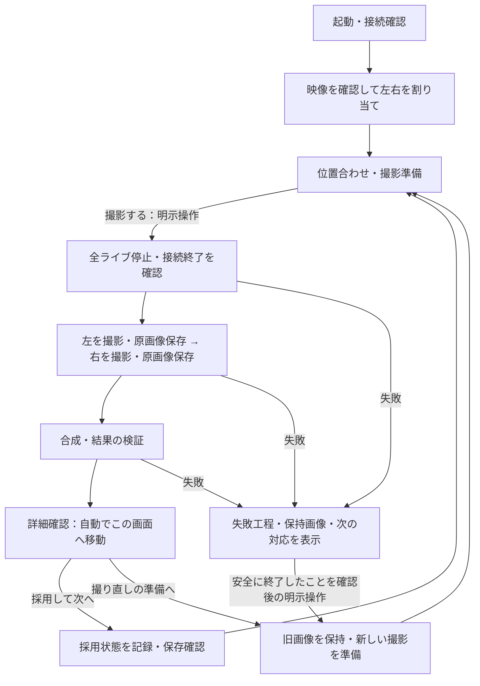

# 操作者画面・警告・失敗復旧仕様

## 2026-09-22 本体状態の正規読取り経路（開発ソースv3）

ReviewCli契約v3に `gui-status --instance <PID-UTC起動ticks>` を追加した。MainWindowのバージョンダイアログでinstanceを提示し、GUIと同じDispatcher上からUiState/busy/live-view/撮影可否/履歴可否/終了中を観測する。照会はCommandを呼ばない。Launcher/HardwareSingleは対象外。固定prefix pipe、CurrentUserOnly、client/server双方の同一Windows session、process開始時刻と保持handle、OS pipe server PIDを照合する。5秒の協調deadline・要求256/応答4096 bytes、status固定命令だけ。停止したinstanceへ再接続/fallback/自動再試行しない。観測された可否は業務承認ではなく、撮影・採用の命令は追加していない。

server契約version/buildと観測時刻を返し、CLI自身のbuildと区別する。通信障害でカメラ状態を変更しない。終了時は既存のSDK/Agent終了確認を先に維持し、その後status endpointを閉じる。終了確認が失敗して本体が残る場合、そのまま観測可能とし、lease解放やカメラ強制終了を行わない。具体的手順・限界は [機械操作入口](MACHINE_OPERATION.md) を参照。

検証（実機0回）: 新OperatorStatusTests系列は4/5消費（初回compile error CS9135、修正後実pipe/CLI試験3回PASS。追加ごとにserver version/oversized拒否/同sessionサーバー検証を確認）。実CLI子processから明示instanceの値を取得し、非正規ID/開始時刻違い/未知命令/サイズ超過を拒否、拒否後endpoint継続、Dispose完了を確認した。WPF最新buildはexit 0、warning 0/error 0。新試験をM3ソリューションへ登録し、初回はDualCameraFlowTestsのassets未復元でNETSDK1004、当該projectを復元後のsolution buildはexit 0、warning 0/error 0。既存verify-review native統合をv3で1回回帰確認しPASS（当該系列累計5/5、以後根拠なく再実行しない）。独立read-onlyレビューPASS。

実GUIに表示されたinstanceからの照会、異Windows session拒否の実行試験、実GUI通常終了後の拒否、最新v3の梱包は未検証。合成observerを用いた実pipe試験を実GUI/実機証拠にしない。既存凍結候補 `software-f9cafd4-01` は契約v2のまま保持し変更していない。GUI操作、対象結果表示、採用認可、撮影/次の準備への外部AI命令は未完で、roadmap stage 5はpartial。

## 2026-09-22 別コンテキストからのCLI発見

READMEから [正規機械操作の入口](MACHINE_OPERATION.md) へ接続した。対象を固定候補 `software-f9cafd4-01` とし、記録されたmanifest hash/source commit/23ファイルのsize・hashを照合した後に同梱CLIのdescribeへ進む。Windowsローカル・同一利用者の読取り権限、対応version、保存先を推測しないこと、空結果/観測不能の区別、非対応のGUI操作/撮影/採用を明記した。

2026-09-22 22:08 JST頃、会話履歴を渡さない独立担当がREADMEから文書を発見し、文書中の照合手順を実行して全件一致を確認。その後のdescribeは一回のみ、exit 0、appId `a0-camera-stitcher-review-cli`、version 2、build `1.0.0+f9cafd4e2b01f90e484ec20c949b0d33a8ea3779`、environment `Windows-local standalone read-only`、operations `describe/reviews/verify-review` を取得した（発見系列1/5）。実データ照会・GUI操作・実機操作は0回。これで当該候補の静的配置/読取り契約発見は確認したが、起動中GUI instance発見・業務更新・AI採用認可・製品全体の機械操作適合は未完。新しい候補を自動選択する機能は設けていない。

## 2026-09-22 SDK非同梱ローカル候補

GUI確認追記（新規GUI候補系列1/5、実機0回）: `software-f9cafd4-01/app/A0CameraStitcher.M3.OperatorShell.exe` を引数なしで一度起動。起動モード選択の実ウィンドウとaccessibility treeを取得し、明示SIMULATED選択、HardwarePending表示、選択前にカメラ操作を開始しない案内を確認した。ただしSIMULATEDボタン入力は `coordinate input geometry is unavailable`、再観測後の前面化は `failed to activate captured window`。起動画面のままで履歴操作へ未到達、GUI受入はInconclusive。画面取得はアプリ描画を示さず、OS上にLockAppあり（存在だけではロック確定の証拠ではない）。追加入力を停止し、操作者のデスクトップ確認を待つ。OperatorShell PID 19656の起動画面を残した。CameraAgent/DualCameraAgentプロセスはその時点で検出されず、候補23ファイルのSHA-256は全件manifestと一致。採用・撮影・SDK/WPD操作を実施していない。起動検出を履歴導線・正常終了・実機受入の合格へ読み替えない。

`scripts/New-LocalSoftwareCandidate.ps1` はcleanなcommitから本体とReviewCli v2を新規候補へpublishする。既存候補・native buildの再利用は禁止。候補専用の新規native buildをSDK root明示空・VS2022 x64でconfigure/buildし、同梱ファイルを許可リストで限定する。開始/終了時のsource状態を確認し、commit・recipe SHA-256・全同梱ファイルのsize/hashを完成manifestへ記録する。失敗時は未完成候補を残し、上書き・自動再試行しない。

ソフトウェア候補 `build/local-software-candidates/software-f9cafd4-01` をsource commit `f9cafd4` から1回で生成しexit 0。既存nativeソースのC4819警告あり。完成manifest SHA-256は `2A284F550F0AC68070E9333466407301D642C92728FB7A4D7218845D7BBE0117`。23ファイルのsize/hashを照合した。同梱apphostのdescribe v2成功、同梱CLI DLLと同梱native adapterを使う `ReviewCliTests ... --packaged` はexit 0（verify-review系列累計4/5）。正常結果、種別/ID、不正metadata、原画像欠落/改変、採用拒否を合成fixtureで検証し、候補23ファイルのhashが前後不変だった。既存候補名での再実行は生成前に拒否されmanifest不変（候補系列2/5、生成1回＋拒否確認1回）。テストproject buildはwarning 0/error 0、初回の誤ったproject名はMSB1009でテスト未実行、訂正後build成功。独立レビューの既存native出力再利用とdirty出所の指摘は修正済み。

本候補はSDK・撮影画像を含まないソフトウェア確認用であり、実機用候補・GUI受入・配布承認・releaseではない。.NET 10 Windows Desktop runtimeとnative runtime依存があり、clean PC未検証。ライセンス文書2件は同梱するが再配布審査を代替しない。稼働中GUIへの外部AI操作、AI採用代行、新セッションからの配置発見、実GUI導線、二台同時Live View、撮影/品質の受入は引き続き未完。今回実機操作0回、preview枠2/5のまま。

## 2026-09-22 正規CLIの保存結果検証（契約v2）

`ReviewCli`に `verify-review --product-root <固定ローカルdriveの既存product root絶対path> --result-id <空でない小文字GUID N> --expected-kind <Product|Simulated>` を追加した。`describe`が入力・出力・制限・権限を返す。`reviews`のrootはoperator-reviewディレクトリ、`verify-review`のproduct-rootはその親であり区別する。契約versionは2。従来のmetadata一覧とJSON envelope形状は維持するが、呼出側はversionとoperationsを確認する。

検証対象は既存Pendingの1結果のみ。確認記録を読み、GUIと同じ `VerifyHistoricalReviewAsync` でmanifest・左右原画像・合成をnative decode/hash検証し、最後に確認記録を読み直して途中変更がないことを確かめる。CLIが実行できるのは配置ディレクトリ直下の固定名 `A0CameraStitcher.M2Adapter.exe` のみ。任意exe引数・環境変数上書き・shell経由を設けない。exeと祖先のreparse/UNC/device/ADS/非固定driveを拒否し、exe read-lockを保ちながらhash取得・起動する。既存directory・lockがなければ作らず観測不能を返す。同じWindows利用者のfilesystem読取り権限を使用し、昇格しない。

結果は対象fingerprint、結果ID/撮影ID、宣言されたreviewKind、manifest hash、合成とCAM-A/Bの相対path/hash/寸法、原画像size、adapter hash、metadataの更新時刻/観測時刻を返す。絶対path・画像bytes・SDK個体情報・自由文例外は返さない。reviewKindは保存記録の種別であり、機材の実在やhardware acceptanceの証明ではない。観測後にファイルが変わらない保証や採用の許可にはならず、採用はその時点で再検証する。

`invalid_input`、`invalid_metadata`、`invalid_artifacts`、`access_denied`、`observation_unavailable`、`observation_timeout`を区別する。対象画像ファイルの欠落/改変はinvalid_artifacts、固定adapterの欠落はobservation_unavailable。verifyには40秒の協調deadline（内部artifact検証30秒）があり、自動再試行なし。OS同期I/Oの強制停止を保証しない。SDK/WPD/CameraAgent・撮影・採用・削除・再合成は実行せず、`accept`/`capture`は非公開のまま。

この段階で確認したのはテスト用の独立CLI配置＋自製M2adapterによる正規read-only経路である。実配布候補への同梱、新セッションからの発見、稼働中GUI instanceへの認可済み業務操作、AIの採用代行承認、実GUI/実機受入は残件。CLIの成功を主要業務全体の機械操作適合にしない。

統合検証: ReviewCliのRelease buildはexit 0（warning 0/error 0）。`dotnet run --project tests/m3/ReviewCliTests/A0CameraStitcher.M3.ReviewCliTests.csproj -c Release --no-restore -- <ReviewCli.dll絶対path> <M2Adapter.exe絶対path>` は、検証項目追加に合わせた3回すべてexit 0（新規系列3/5）。実CLI＋native子processでdescribe v2、ID/種別分離、adapter不足、原画像欠落・改変、不正JSON、未知/重複引数、非公開採用拒否を確認。返された相対path/hash/寸法と実fixtureを照合し、製品保存root内の全ファイルSHA-256が読取り前後で不変であること、JSON文字列を展開して絶対path漏れがないことを確認した。従来のmetadata CLI契約もDLLを1回実行してexit 0（系列累計2/5）。独立レビューの欠落分類指摘を修正しPASS。実機操作0回、GUI受入・実配布確認なし。

## 2026-09-22 過去Pendingの明示採用

本節は次節の閲覧のみの導線を更新する。「ファイル → 未採用の履歴」で、保存結果を再検証し、合成/CAM-A/CAM-Bを選んで詳細表示できる。確認状況の件数は案内であり、3枚すべての表示や追加のチェックボックスを採用の必須条件にしない。選択した結果を詳細表示した後、人が「採用を記録」を一回押すことで採用を開始する。画像表示だけでは採用・撮影しない。

採用時はもう一度nativeのmanifest検証・JPEG decodeとmanaged hash照合を行う。表示時と同じ結果ID・撮影ID・運用種別・manifest hash・原画像/合成のhash/path/寸法/profileか確認し、左右原画像・合成・manifestのread-lockを保存完了まで保持する。既存確認記録のlockを取得し、`.partial`なし・期待したPendingと全フィールド一致を確認してから、Acceptedを`.partial`→flush→atomic rename→再読取りで記録する。確認記録のroot/lockがない場合は作らない。変更済み・採用済み・不完全な記録は拒否し、自動再試行しない。

保存結果不明時は当該採用操作を再送しない。明示的に履歴を読み直して状態を確認する。採用中の「閉じる」は保存処理へcancelを送らず、結果確定まで本体の操作ゲートとwindowを維持する。閉じる要求があっても、失敗・timeout・不明の場合は警告を表示したwindowを残し、操作者の次の判断を待つ。元の結果を削除・変更せず、採用成功後も次の撮影は自動開始しない。本体で現在確認中の同じ結果を履歴から採用した場合は、採用状態だけを本体へ反映する。

これは合成結果の人による採用であり、rig承認・実機成立・品質の自動合格を意味しない。正規外部AI操作、実GUI操作の受入、二台同時Live Viewおよび撮影/品質の実機確認は未完了。roadmap stage 5はpartialのまま。

統合検証（実機0回）:

- `dotnet run --project tests/m3/HistoricalReviewTests/A0CameraStitcher.M3.HistoricalReviewTests.csproj -c Release --no-restore -- <build/worker-selection-stub/Release/A0CameraStitcher.M2Adapter.exeの絶対path> --acceptance` は1回目でexit 0。実native子processと合成fixtureで、既存storage必須、manifest/原画像変更、古いPending、cancel、partial、重複採用の拒否、保持中4ファイルの書込み拒否、manifest open失敗時のlock解放、採用の再読取りと原画像保持を確認した。
- 同じHistoricalReviewTests DLLを従来の読取り検証引数で1回実行しexit 0（当該系列累計4/5）。従来のv1/v2、欠落・改変・ID不一致の拒否を回帰確認した。
- `dotnet run --project tests/m3/OperatorShellTests/A0CameraStitcher.M3.OperatorShellTests.csproj -c Release --no-restore -- --historical-review-window` は今回3回ともexit 0（前回compile失敗を含む系列累計5/5、追加実行なし）。採用開始は一回の明示操作のみ、表示後は未採用維持、結果変更で表示件数をリセット、結果不明時の再送禁止、成功時の候補除去、起動時Pending一覧の採用後更新、撮影0を検証した。

独立レビューで、採用中の閉じるによるpartial誘発、古いPending表示、失敗時にclose要求へ従って警告が消える問題を修正した。最後のclose条件修正は上限到達後のため同系列を再実行せず、`dotnet build tests/m3/OperatorShellTests/A0CameraStitcher.M3.OperatorShellTests.csproj -c Release --no-restore -v quiet`（exit 0、warning 0/error 0、47.06秒）と独立コードレビュー（確定blockerなし）で確認した。実windowの終了競合操作・描画受入は未検証であり、ソフトテストを実GUI/実機受入へ読み替えない。

## 2026-09-22 過去Pendingの本体閲覧導線（7a55fc2時点の検証記録）

本体の「ファイル → 未採用の履歴（閲覧のみ）」から、同じproduct rootの確認記録を25件単位で読み取る。ページ内のPendingかつ運用種別一致（Product/Simulated）のみを開く対象にし、採用済みだけのページでも次ページへ進める。OriginalsOnlyはこの画面の対象外。明示選択した合成/CAM-A/CAM-Bの1枚を、保存済みmanifest・左右原画像・合成画像の再検証後に詳細表示する。画像を開く際にも同じread-lock付きstreamでSHA-256照合とdecodeを行う。SIMULATED表示は実機受入へ読み替えない。

起動確認前・起動失敗・撮影/復旧/AF/Live View中・カメラ状態不明時は入場不可。binding ReadyにもSDK所有が残り得るため、この版はbinding開始前のみ許可する。履歴modal中は本体をbusyにし、復旧経路を含む撮影も明示的に禁止する。閉じると元の結果確認状態を維持し、確認記録の採用・再撮影・再合成・設定変更・SDK/WPD操作を実行しない。再検証timeoutは表示を中止し自動再試行しない。

この導線は閲覧のみ。履歴からの明示採用、正規外部AI操作、実GUIの操作受入は別の残件であり、roadmap stage 5を完了扱いにしない。

統合検証: `dotnet build tests/m3/OperatorShellTests/A0CameraStitcher.M3.OperatorShellTests.csproj -c Release --no-restore -v quiet` はexit 0（既存native文字コード警告18件、error 0）。追加した初期化失敗テストのconstructor引数不足で最初の`dotnet run ... -- --historical-review-window`はcompile失敗となった。引数を修正した2回目はbuildを含めexit 0、`PASS historical review window gates, paging and same-stream image verification; hardwareOperations=0`。この新規系列は2/5回（試験実行は1回）で、実機preview枠は2/5のまま。実ファイルの27件ページング、初期化前/失敗後・Live View/終了不明時の入場拒否、履歴中の操作禁止、同一streamでの画像hash照合・変更拒否をソフト試験で確認した。Windowを人が操作した受入ではない。独立コードレビューの指摘（復旧経路ゲート・重複例外処理）を修正しPASSを取得した。

## 2026-09-22 実つなぎ目への移動

合成時の実レンダリングで、両原画像が寄与する領域（0 < feather weight < 1）から50% blendに最も近い代表点を選び、crop後の出力pixel座標をmanifest v2へ記録する。画面の「つなぎ目へ移動」はその点を100%表示で中央付近へスクロールする。画像全体の中央を代用しない。viewport端ではscroll可能範囲に収めるが、記録座標を別点に変更しない。

v1/記録なし/重複JSONキー/型不正/範囲外/出力size・SHA-256不一致/実bitmap寸法不一致ではボタンを無効にする。v1 manifestはnative側の既存結果読込を維持し、つなぎ目情報のみ「なし」とする。原画像とrig profileを変更せず、品質合格や人の採用を自動判定しない。

親による統合確認（今回実機0回）:

- `dotnet build src/m3/OperatorShell/A0CameraStitcher.M3.OperatorShell.csproj --no-restore -c Release -p:M2AdapterBuildDirectory=.../build/seam-navigation-wpf` はexit 0、warning 0/error 0、18.08秒。画面を実際に開いた受入ではない。
- 非対称cropの回帰試験を追加し、出力幅22に対してseam X=9（画像中央X=11ではない）を確認。`ctest --test-dir build/seam-navigation-native -C Release -R '^m2_offline_stitcher_contracts$' --output-on-failure` は1/1 PASS、3.73秒、exit 0。合成・v2保存・再読込・元画像保持の実nativeコードを合成fixtureで検証した。
- FoundationTestsをRelease再ビルドして同worktreeのDLLに `--seam-navigation` を指定し、1/1 PASS、exit 0。型不正・重複座標・旧schema・範囲外・同サイズ別内容の画像を拒否する。実機画像や実WPF scroll/DPIの操作確認は未実施。

先行並行担当のWPF build 2本は終了コードを回収できず合格扱いしない。親がOSで両プロセスの非残存を確認してから上記1回を実行・回収した。native buildで一度誤ったtarget名を指定しMSB1009になったが、CMake記載の `m2_offline_stitcher_contracts` へ訂正してbuild exit 0を確認してから試験した。新機能の合格根拠は上記の最終統合結果とし、これらの失敗/結果不明をPASSへ読み替えない。

## 2026-09-22 統合確認

`d500cac` の統合先で既存依存をlocked restoreし、`dotnet build tests/m3/OperatorShellTests/A0CameraStitcher.M3.OperatorShellTests.csproj --no-restore -c Release` はexit 0（既存native文字コード警告26件、error 0）。生成した同worktreeのDLLを `--hardware-single-history` で1回実行し、`PASS hardware single historical review is read-only and fail-closed`、exit 0を回収した。ページ送り・未採用で閉じる・撮影ID不一致拒否を含むfake operationsの試験で、実機GUI/SDK/WPD受入ではない。

先行buildには資産情報不足、CMake検索path不足、既存CMake cacheのplatform不一致があり、合格扱いしない。旧buildの観測handle消失時も成否を推定せず、関連process非残存を確認した後に上記の実行結果を取得した。実機追加操作0回、preview枠2/5のまま。

## 2026-09-21 改訂設計：撮影ごとの詳細確認

本人合意により、標準運用を「位置合わせ → 撮影 → 詳細確認 → 採用 → 次の原稿」とする。本節は以下の既存画面仕様のうち、ステージ自動切替・撮影後の戻り先・主操作の配置について優先する。実装済みを表すものではない。機体照合、保存、失敗時の安全契約は維持する。

### 導線



次の撮影は準備画面の「撮影する」を押すまで始めない。採用・撮り直し・画面復帰による自動撮影、自動再試行は行わない。接続・機体照合が有効なら毎回の再割当は不要。接続変更やbinding失効時は接続確認へ戻し、割当を再確認する。

### 設計図A：位置合わせ・撮影準備

```text
┌─────────────────────────────────────────────────────────────────┐
│ A0 Camera Stitcher   準備 > 位置合わせ > 撮影 > 結果確認           │
│ 運用モード / 保存先 / 総合状態                                   │
├───────────────────────────────┬─────────────────────────────────┤
│ 左：カメラA                   │ 右：カメラB                     │
│ 接続 / Live・停止 / 更新時刻  │ 接続 / Live・停止 / 更新時刻    │
│                               │                                 │
│          ライブ映像           │          ライブ映像             │
│       原稿範囲・重なりガイド   │       原稿範囲・重なりガイド     │
│                               │                                 │
│ ISO / シャッター / 絞り       │ ISO / シャッター / 絞り         │
├───────────────────────────────┴─────────────────────────────────┤
│ 設定差 / カード / 保存先 / 撮影できない理由                       │
│ [設定を確認] [保存先を開く]                         [撮影する]   │
└─────────────────────────────────────────────────────────────────┘
```

- 二台同時ライブはFR-LV-003 / ADR-0031の技術ゲート通過後の目標配置。現在の一台選択表示を、二台ともLiveと偽装しない。未対応時はその旨と動作中の一台を明示する。
- 左右表示はリアルタイム合成ではない。重なりガイドも実際の合成成功を保証しない。フレームの厳密な時刻同期は保証しない。
- 数値は実測値と取得時刻を表示し、未取得を0や正常値で埋めない。電池残量は追加実装・実機検証待ち。ISO等は読み取り専用とする。
- 映像未確認の候補は割当確定不可。映像停止時は最終画像に「映像停止」を重ねる。
- 撮影中は工程・進捗を中央に表示し、二重開始や競合操作を無効化する。

### 設計図B：詳細確認（撮影後の標準画面）

```text
┌─────────────────────────────────────────────────────────────────┐
│ 結果確認   撮影ID / 確認待ち                                      │
├────────────────────────────────────────────┬────────────────────┤
│ [合成結果] [左原画像] [右原画像]            │ 処理・保存状態     │
│                                            │ 原画像：保存済み   │
│                                            │ 合成：完了・失敗等 │
│            選択画像を大きく表示            │ 人の確認：未確認   │
│                                            ├────────────────────┤
│                                            │ 確認の目安         │
│                                            │ ・原稿の欠け       │
│                                            │ ・ピント           │
│                                            │ ・明るさ           │
│                                            │ ・つなぎ目         │
├────────────────────────────────────────────┴────────────────────┤
│ [全体] [100%] [つなぎ目] [保存先を開く / 書き出す]                 │
│ [撮り直しの準備へ]                              [採用して次へ]   │
└─────────────────────────────────────────────────────────────────┘
```

- 全体表示、100%表示、パン、つなぎ目への移動を用意する。「100%」は画像1pixelを表示1pixelで確認する操作とし、元画像を書き換えない。
- 撮影終了時は自動で結果確認へ移動し、時間経過やライブ復帰で結果画面を閉じない。通常時の手動表示切替の規則に対する明示例外とする。
- 原画像は採用前に自動保存する。「採用」は画像保存ボタンではなく、人の確認結果を記録する操作。自動判定の合格、原画像保存、合成完了、人の採用を別状態にする。
- 採用対象の撮影ID・結果IDと確認日時をローカルに保持する。記録成功後だけ次へ進む。再起動しても未確認・採用済みを区別できること。記録方法は既存保存契約に合わせて実装時に決め、延期済みの汎用ReviewRecord artifact化を本変更の必須条件にしない。
- 未確認のまま終了した結果は未確認として保持する。撮り直し準備で旧画像を削除・上書き・自動採用しない。同じ撮影IDの再実行は禁止。
- 確認項目は案内であり、毎回複数の必須チェックボックスを押させない。採用は明示操作一回とする。
- CaptureRecoveryOnlyでは合成を「未実施（撮影・原画像保存のみ）」と表示し、原画像を初期表示する。操作名は「原画像を確認して次へ」とし、合成・A0品質の採用と混同しない。SingleCameraでは右画像・合成・つなぎ目操作を非表示または理由付き無効にする。
- 原画像保存・合成に失敗した結果を正常結果として採用させない。残った原画像の閲覧・書き出しは検証済みのものだけ許可する。

### 失敗時・AI操作・受入条件

履歴成果物のmanaged接続（2026-09-22）: `M2OfflineStitcherProcessAdapter.VerifyHistoricalReviewAsync` は明示されたPending/ProductまたはSimulated記録のN形式job/transaction IDからcanonical pathを組み立て、manifestと合成画像、CAM-A/B原画像を読取りlockで保持する。実M2Adapterの `verify-published-stitch` 応答を照合し、左右それぞれのsize/SHA-256/JPEG寸法とnative全画素decode、合成画像のsize/hash/寸法を再確認して `HistoricalReviewArtifacts` を返す。未知alias・別ID・欠落・改変・reparseを拒否し、30秒協調cancel、再試行・撮影・再合成・書込みなし。read lockはAPI完了時に解放されるため、このsnapshotを将来の採用時点までの不変保証には使わない。ReviewKindとprofile ID/versionは記録由来の情報として保持し、実機証明・rig承認・品質承認には昇格しない。GUI一覧・明示選択・閲覧・採用直前再検証は引き続き未接続。

初回の実process統合試験でnative manifest readerの不要なDELETE権限がmanaged読取りlockと競合しWin32 32でFAIL。`ManifestFileHandle` をreadとrename用途に分け、publisherだけDELETEを要求する修正を行った。読取り側の保護は緩和していない。二回目は拒否が正しく返したInvalidDataExceptionをtest helperが捕捉しない不備でFAIL、helperの型判定を修正。三回目の `dotnet run --project tests/m3/HistoricalReviewTests/A0CameraStitcher.M3.HistoricalReviewTests.csproj -c Release -- <M2Adapter.exe絶対path>` はexit 0、`historicalReviewArtifacts=passed`。v1/v2の正常、破損v2 seam、Accepted/不正ID/別transaction、precancel、左右原画像改変/欠落、合成画像改変、正常照会前後のfile hash不変を確認。fixture画像生成のみで実機操作0回。独立レビューのv2不足指摘をこの追加試験で解消した。

native変更後のM2Adapterと `a0_published_stitch_command_tests` build exit 0、`published_stitch_command_contracts` は1/1 PASS（0.27秒、当series累計3回）。manifestのpublish/renameとread-only照合を同じfixtureで確認した。実機preview枠は2/5消費・残り3回を維持。

独立再レビューはrename専用DELETE権限と通常readerの読取り権限分離、およびv2正常/範囲外seam拒否の追加を確認し、この変更範囲の残存blockerなし。GUI復元・実画像の品質・製品受入を合格範囲へ含めない。

二台Pending履歴の復元準備（2026-09-22）: 既存VMはPendingを列挙して未対応と表示するだけで、`RecoverAndStitchAsync` は再合成を伴うため閲覧には使わない。M2Adapterへ `verify-published-stitch --job-directory <absolute-local-directory> --stitch-job-id <id> --capture-transaction-id <id>` を追加。既存 `VerifyPublishedStitchJob` によりmanifest schema/出力size/hash/job IDを照合し、capture ID、WICによるJPEG全画素decodeと寸法、decode後hashを確認する。root ancestorと対象fileのreparseを拒否し、撮影・再合成・保存・削除なし。stdoutは `result=verified-published-stitch` と正規化済み `manifestJson` のみ。これは合成出力の読取り時点の検証であり、左右原画像・実行環境・rig承認・品質受入の検証ではない。原画像照合・managed adapter・履歴選択UI・採用直前の再検証接続は残件。

検証: M2Adapter/専用fixture target build exit 0。専用CTestの初回は生成helperへstitched.jpgを渡したfixture準備不備でFAIL（製品検証へ未到達）。生成をoriginal.jpgで行いexact synthetic fixtureのみrenameする修正後、二回目は `published_stitch_command_contracts` 1/1 PASS（0.37秒、exit 0）。同じwmain入口をprocess内で呼び、正常、別job ID、別capture ID、出力改変、manifest欠落を確認。正常/ID拒否照会前後でmanifest/画像hash不変を確認。独立レビューでも同じfixture不備を指摘し修正した。別processでのmanaged接続や実ユーザー画像による受入は未実施、カメラ操作0回、実機preview予算2/5のまま。

実装追跡（2026-09-21）: `FileOperatorReviewStore` は `Pending` → `Accepted` のローカルmetadataを原画像と別に保存する。未知項目、破損JSON、未publishの `.partial`、競合書込み、別対象への差替えを拒否し、AcceptedからPendingへ戻さない。未完了metadataを自動削除しない。公開後の再読込検証はキャンセルされても完遂する。これはreview保存の部品であり、画像確認・実機GUI受入の完了を意味しない。

今回の実装範囲は `MainWindow` と `HardwareSingleCameraWindow` の撮影結果導線。`AcceptReviewCommand` は現在の撮影ID・結果ID・原画像/合成画像hashを照合し、Pending保存済みの成功結果だけを採用できる。Hardware SingleもCamera Agentのcanonical run/transaction/alias pathから原画像を再検証してからPendingを復元し、採用直前にも再検証する。採用保存失敗では画面を維持し、自動再送しない。`PrepareNewCaptureCommand` は未採用でも旧画像を保持した撮り直し準備を許し、撮影を開始しない。結果画像は保存済みartifactからのみ表示し、`ReviewImageWindow` で全体・実ピクセル100%・中央の拡大とスクロールを提供する。中央移動は実際のseam位置の自動検出ではない。

Hardware Singleは、`Pending`かつ`OriginalsOnly`の既存review recordを新しい順に25件ずつ一覧表示でき、前後のページ送りで古い記録にも到達できる。未採用のまま「新しい撮影を準備」で履歴表示を閉じても、Pending記録と原画像は保持し、自動撮影しない。操作者が一件を明示選択した時だけ、その撮影IDでCamera Agentへread-only `get-transaction-result` を照会する。返答の撮影ID一致、完了状態、canonical原画像の既存path/size/SHA-256再検証が揃った時だけ確認画面へ入る。撮影・Live View・未確定transaction中は開けない。journal欠落・破損・別ID・未完了・原画像改変・Agent未検出では結果を開かず、撮影・再試行・削除を行わない。追加のartifact indexやファイル走査は使わない。

残件: 実seam位置への移動、実機GUI受入。二台同時ライブの技術gateと外部機械操作経路は別に残る。

2026-09-22 software verification: `dotnet restore A0CameraStitcher.M3.slnx --locked-mode`（既存依存のみ）は成功。`dotnet build tests\\m3\\OperatorShellTests\\A0CameraStitcher.M3.OperatorShellTests.csproj --no-restore -c Release` は0 warning / 0 errorで成功した。追加した `--hardware-single-review` は3.1秒で `hardware single review records explicit acceptance` と `hardware single review restores pending results and rejects changed originals` の2件がPASSした。先行した包括 `--review-ux` は時間上限前に上記を含む4件のPASSを出力したが終了コードを回収できなかったため、suite PASSの証拠にはしない。実機・SDK/WPD・GUI受入は実行していない。

機械操作標準の段階対応: 今回のUI commandと安定したUI識別子はGUI受入用の補助経路。外部AIが起動中アプリの特定結果を照会・採用する認可済みCLI/IPCは未接続であり、内部VMの試験を正式な外部API受入に代用しない。採用対象ID・環境・副作用・再送結果を確認できる正規経路の追加と実接続受入を残件として維持する。

2026-09-22の段階実装（以下は契約v1時点の記録。現行は冒頭のv2節を参照）: `src/m3/ReviewCli/A0CameraStitcher.M3.ReviewCli.csproj` をWindowsローカルの保存済みreview metadata読取り専用CLIとして追加した。`describe` と `reviews --root <既存operator-review絶対path> [--offset 0] [--limit 25]` のみを公開し、GUIが使用する `FileOperatorReviewStore` の検証を共有する。rootは同一Windows利用者が読める固定drive上の既存directory、ancestor reparse/UNC/device pathは拒否。アプリinstanceには接続せず、権限昇格・camera agent起動・画像読込み・撮影・採用・削除はしない。明示的なroot指定は観測対象を指定するだけで、採用の業務承認にはならない。

出力はstdout JSON、requestId/契約version/build/環境/観測時刻/status/data/errorCodeを含む。対象pathは直接返さず正規化pathのSHA-256 fingerprintを返す。成功0件と `observation_unavailable`・`invalid_metadata`・`access_denied`・`observation_timeout` を区別し、異常時のexitは2、成功は0。自由文例外・未知の入力operationは反射しない。既存 `.review.lock` を読取りで排他Openし、directory/lockを新規作成しない。未初期化は0件にせず観測不能、`.partial`や破損記録は推測せず拒否する。最大1000記録を検証、返却25件まで、offset 0..1000。10秒の協調cancelがあり、自動再試行なし。OSの同期file I/Oの強制停止保証ではない。

各ページは独立したlock内snapshotであり、ページ間のGUI更新があればoffset位置は変わり得る。metadataのAcceptedは画像検証・品質承認・release受入の証拠ではない。元画像hash照合、稼働中GUIへの明示対象操作、AIによる採用認可、主要業務のend-to-end機械操作受入は未完である。

独立read-onlyレビューはstandalone metadata照会の範囲でblocking findingなし。既存lockの非作成、reparse/partial拒否、scan/page上限、自由文抑制、画像検証を保証しない出力を確認。GUI採用や実画像整合性をレビュー合格へ含めない。

検証: CLI/testのRelease build成功（警告0、error0）。`dotnet run --project tests/m3/ReviewCliTests/A0CameraStitcher.M3.ReviewCliTests.csproj -c Release -- <ReviewCli.dll絶対path>` を1回実行、exit 0、`reviewCliContracts=passed`。実CLI子processでdescribe、27件のページ送り、正常0件、未初期化/欠落/重複引数/上限超過/非公開accept/partial拒否を確認。読み取り前後の全fixture fileのSHA-256一致を確認した。合成metadataのみで実カメラ/実画像/実ユーザーreview保存先への操作は0回。既存GUIの実機受入を代替しない。

エラーは「何が失敗したか」「何が保存されたか」「次にできる操作」を通常表示し、SDKコードやログは技術詳細へ分ける。原因未確定のエラーを電池不足と断定しない。

人とAIは同一の状態・操作可否判定を使う。撮影開始、状態照会、画像表示、採用、次の準備を別操作とし、安定した操作ID、対象撮影ID、完了結果、拒否理由を提供する。AIによる採用代行は別の明示依頼がある場合に限り、既定では人の確認を待つ。結果照会やタイムアウトを理由に撮影・採用を再送しない。

実装受入では、①撮影後の結果画面への遷移、②確認中の非自動復帰、③採用前の原画像保存、④採用記録失敗時に画面を維持、⑤撮り直し時の旧画像保持、⑥未確認状態の再起動復元、⑦モード別表示、⑧片側停止・取得不能・失敗工程の明示、⑨キーボードとAI操作でも同じ安全ゲート、を確認する。二台同時ライブの実機受入は別ゲートであり、本設計更新で完了扱いにしない。

## 適用範囲

本仕様は`FR-UI-001`〜`FR-UI-003`の画面契約である。WPFには`模擬動作（実機未接続）`のmode-aware shellと、明示起動する`HardwareSingleCamera`画面がある。後者はCamera Agent protocol、local pending state、canonical original再検証、明示exportまでsoftware boundaryを実装するが、実D810、WPD/SDK、actual JPEG、実画面操作の受入証拠はまだない。

## 画面表記

画面に出す文字は操作者の言葉で書き、開発者語をそのまま置かない。内部の識別子・enum・ログは英語のままでよいが、画面表記は次に統一する。

| 内部の呼び方 | 画面表記 |
| --- | --- |
| Live View | ライブ表示 |
| canonical original | 原画像 |
| fixed-local export | このPCのフォルダへ保存 |
| identity | 機体照合 |
| card | カード |
| focus lock | ピント固定 |
| watchdog | 制限時間 |
| transaction | 撮影ID |
| `FailedPartial` | 撮影失敗（再開不可） |
| `Degraded` | 警告確認 |
| `NotApplicable` | なし |
| `SIMULATED` | 模擬動作（実機未接続） |

`Blocker`／`Caution`／`Info` の3語だけは英字のまま残す。色に依存せず重大度を文字で併記するアクセシビリティ要件が、この3語の同一性を前提にしているためである。

支援技術向けの`AutomationProperties.Name`も同じ表記に合わせる。読み上げだけが別語彙になると、画面を見ている人と読み上げを聞いている人の間で会話が成立しなくなる。

## 画面構成

日常操作は`撮影ダッシュボード`一画面に集約する。画面は 1920×1080 の固定キャンバスとして構成し、ウィンドウ側では等比縮小だけを行う。操作者ごとに画面サイズが違っても要素の相対位置が変わらず、撮影手順の記憶と一致し続けるためである。縮小で生じる余白はマスク色で塗り、スクロールは発生させない。

縦は タイトルバー40px ／ メニューバー30px ／ コンテンツ ／ ステータスバー28px の4層とする。タイトルバーはOS標準クロムではなく自前で描き、アプリ名・運用構成・総合状態・`模擬動作（実機未接続）`・設置プロファイル・ウィンドウ操作を載せる。ステータスバーには撮影ID・原画像・合成・占有状態を常時置く。コンテンツは左カラムのステージと、右カラム372px（フォーカスパネル、撮影、アクションゾーン）からなる2カラムで構成する。左ナビゲーションは設置せず、低頻度のグローバル操作はメニューバーへ集約する。`設置・校正`、`カメラ設定`、`保存・診断`はメニューから到達する保守画面とし、active transaction中は該当メニュー項目を無効化して移動を禁止する。カメラ設定はread-onlyで、実機write契約が承認されるまで変更ボタンを提供しない。フォーカス操作の扱いは「フォーカス操作」節に定める。

ダッシュボードは次を常時表示する。

- 明示選択した`SingleCamera`または`DualCamera`、required aliases、総合状態、起動セッションの排他同意、profile ID・版・期限、保存先
- タイトルバーのバッジとして、選択中mode、総合状態、`模擬動作（実機未接続）`
- modeが要求するcameraの接続、identity、read-only設定整合、card、Live View。`SingleCamera`では非required cameraの不在をBlockerにしない
- 一台選択式Live Viewと「非原画像・非合成入力」の表示
- 設置判定、予定自動補正、必要な物理調整
- ライブ表示停止、required cameraの撮影・保存、および`DualCamera`だけの合成進捗。`SingleCamera`では合成を`なし`と表示
- 撮影、保持原画像、合成、保存を分離した共通結果領域
- `Blocker`／`Caution`／`Info` の3段と、展開式のerror code・ログ情報

### メニューバー

メニューバーは`ファイル`、`カメラ`、`表示`、`ツール`、`ヘルプ`の5項目で構成する。`編集`は設置しない。原画像を無加工・byte-identicalで保存する契約のため画像編集機能は設計上存在せず、慣習で空メニューを置かない。

| メニュー | 内容 |
| --- | --- |
| `ファイル` | 保存先（このPC内のフォルダ）の指定、このPCのフォルダへ保存、終了 |
| `カメラ` | 運用構成（`SingleCamera`／`DualCamera`）の選択、カメラ設定のread-only表示、観測値の30日profile承認、identity状態、readiness再検査 |
| `表示` | オーバーレイ（グリッド、トンボ、重複帯、安全マージン）のトグル、拡大エリアの倍率、傾き読み値の表示切替 |
| `ツール` | 設置・校正、別jobでの再合成、保存・診断 |
| `ヘルプ` | 技術情報（error code、ログ位置）、バージョン |

メニューバー右端には構図グリッドの分割指定と表示設定のリセットを置く。リセットは1回目を確認待ち、2回目の押下で確定し、3秒放置で解除する。誤操作で構図やピント表示が消えると撮り直しになるためである。

全メニュー項目の有効・無効は`OperatorActionAvailability`に連動する。`Capturing`・`Stitching`中は競合操作を一括無効化し、mode変更はactive transaction外だけで有効とする。メニュー経由の保存先変更・設定操作を状態ゲートの例外にしない。

### ステージ

ステージは左カラムを占め、次の表示モードを手動で切り替える。自動切替と自動交互表示は行わない。

| 表示モード | 内容 |
| --- | --- |
| `CAM-A live`／`CAM-B live` | 選択中カメラの素のフルフレーム表示 |
| 合成プレビュー | 両カメラをA0レイアウトへマッピングした全体表示。ライブ側は選択中カメラのLive View、非ライブ側は最終取得frameの静止画。重複帯を帯と幅pxで示す |

現行の合成プレビューはLive Viewを一台だけ開き、非ライブ側は静止画を表示する。非ライブ側には鮮度バッジ（`静止画 N秒前`）を併記し、静止画であることを明示する。

将来の二台同時Live ViewはADR-0031のSDK capability・安全性gateを通過した後だけ有効化する。横長ステージをCAM-A（左）とCAM-B（右）の二つの独立paneに分け、各paneに`Live`または`映像停止`、最終frame受信時刻、aliasを常時表示する。二つのpaneは同一時刻のframeを保証せず、画像をつなげた合成プレビューに見せない。gate未達時に同時表示のトグルや成功表示を出さない。

`Capturing`・`Stitching`中はステージ全面を覆う進捗オーバーレイ（`ライブ表示は停止中（撮影を実行しています）`・段階ストリップ・制限時間）へ置き換え、黒画面のまま放置しない。この間に触れる操作がないことを面で示す。`Review`ではステージを合成結果ビューアへ切り替え、検証済み原本由来の表示として`合成結果`バッジを付ける。

ライブ表示の全表示モードで「非原画像・非合成入力」の注記を常設する。

操作結果の通知はステージ上端中央へ出し、3.2秒で自然に消す。操作した直後の視線の先で気づけるようにするためで、確認操作は要求しない。

### ターゲット□と拡大エリア

ターゲット□は画面に常に1つとし、拡大エリアの照準とAF優先ポイントを兼ねる。移動はドラッグだけで行い、ステージ上のドラッグを粗い移動、拡大エリア内のドラッグを細かい移動とする。固定座標への5点プリセットは提供しない。実際の原稿四隅と一致しないためである。

ターゲット□は 92×92 の四隅ブラケットと中央十字で描き、ライブ側は明るい緑、非ライブ側は無彩色にする。AFできる側がどちらかを色で示すためである。

拡大エリアはステージ右下へ 236×236 で浮かせ、□周辺を等倍でクロップ表示する。右カラム常設ではなくステージ上に置くのは、撮影対象から視線を外さずにピントを見るためである。倍率は100%と200%を切り替える。拡大エリア内にも□の枠線を描画する。表示ソースはステージの表示モードに追従し、□が非ライブ側カメラの担当域にある場合はフリーズframeを表示して鮮度バッジを併記する。ライブ表示中でない状態（進捗中・結果確認）では拡大エリアを出さない。

### 設置ガイドオーバーレイと傾き読み値

ステージへ重ねるオーバーレイは方眼グリッド、トンボ、重複帯（帯表示と幅px。値はrig profile由来）、安全マージンとし、個別にトグルする。方眼グリッドはステージ表示領域を列数×行数でちょうど等分し、列・行は1〜24で指定する。3×3／4×4／5×5のプリセットを併置する。原稿サイズや割り付けは案件ごとに違うため、分割数を固定しない。トンボは四隅の合わせマークとして描く。

傾き読み値はステージ下部の常駐行へ表示し、ライブ表示frameからの原稿エッジ検出による面内回転（`ROLL`）角と許容範囲チップを示す。撮影ダッシュボードでは表示のみとし、許容値の入力は保守画面（`設置・校正`）へ置く。判定に使わない値の入力欄を撮影導線へ置かないためである。許容値は設定値とし、本仕様では既定値を定めない。面外傾き（`PITCH`）は検出・表示しない。透視解析を要するためである。非ライブ側やframe未取得時は数値を出さず`検出不能`と表示する。

オーバーレイと傾き読み値はガイドであり、合否を判定しない。検出結果を撮影可否・自動補正へ接続しない。Go/NoGoは`ReadinessSnapshot`による設置判定が担う。

### フォーカス操作

フォーカス操作（AF実行、AFエリア・優先フォーカスポイントの指定、MFドライブ）は、露出・WB等の撮影設定writeと区別し、撮影系操作として分類する。採用範囲と安全境界は次のとおりとする。

- UIとSIMULATED（fake backend）は先行して実装する
- 実機モードでは、承認までフォーカスパネルを無効表示とし、無効の理由を併記する（fail-closed）
- 実機へのAF・MFコマンド配線は、hardware-requiredの別Issueとhuman gate承認後にだけ有効化する
- 本分類だけでは実機へのフォーカス操作を許可しない

本分類は`SingleCamera`での撮影設定write禁止を含む既存の常時禁止を緩和しない。

フォーカスパネルは対象カメラ（Live View中のカメラ）、ターゲット□位置を用いたAF実行と合焦結果、MFステップ（粗・微）、フォーカスピーキングのON/OFF、カメラごとの固定状態チップを表示する。□が非ライブ側カメラの担当域にあるときはAFを実行せず、Live View切替の導線を表示する。自動切替は行わない。固定状態チップは撮影のハードゲートにせず、未固定はCautionの表示にとどめる。

フォーカス位置の絶対値スライダーは提供しない。SDKのフォーカス値はopaqueであり、絶対位置制御の裏付けがない。表示する場合はread-onlyの相対インジケータまでとする。PCからのMFドライブ可否はcapability定義に明記がなく未検証である。SDK調査で不可と判明した場合、MF操作系は提供しない。

### アクションゾーン

アクションゾーンは右カラム下部の単一領域とし、UI状態に応じて中身を入れ替える。フェーズナビ・ウィザードは採用しない。準備作業は順序自由であり、撮影から合成までは全自動のためである。

| UI状態 | 表示 |
| --- | --- |
| `NotReady`／`Ready`／`ReadyWithCorrection` | 設置判定カード（Go/NoGoと予定補正量。値は`ReadinessSnapshot`由来）と撮影ボタン2種 |
| `Capturing`／`Stitching` | ステージ全面の進捗オーバーレイ（ライブ表示停止→CAM-A撮影→CAM-A原画像の確認→CAM-B撮影→CAM-B原画像の確認→合成の現在位置と制限時間）。右カラム側は進行中である旨だけを示す |
| `Review`／`FailedPartial`／`Degraded` | 結果パネル（結果サマリ、`このPCのフォルダへ保存`、`撮影済み画像で再合成`、`新しい撮影を準備`） |

進捗ストリップのCAM-B段と自動合成段は`DualCamera`だけに現れる。`DualCamera`では主ボタン直下に処理順の説明（`A→Bの順に撮影し、完了後に合成へ進みます`）を表示する。撮影不可時は撮影ボタンを無効にし、直下へ最初のBlocker理由を表示する。Blockerはボタン直下、Infoはステージ下部の注記行へ配置し、色に依存せず`Blocker`／`Caution`／`Info`の文字を併記する既存規約を維持する。

保存したファイルの控えは右カラムに置き、保存が実際に成功したときだけ増やす。自動保存はしないので、控えが増えていれば操作者が保存したということになる。控えには実際の出力先をそのまま記録し、表示と実ファイルがずれないようにする。

### Live View表示の実機縮退

ステージ、拡大エリア、フォーカスピーキング、原稿エッジ検出は継続Live View frameの供給を前提とする。SIMULATEDは`Simulated`透かしとタイムスタンプを持つ疑似frame sourceから供給する。

実機では継続Live View v2の受入が成立するまで、画面内previewを`hardware.v1`の有限frame probe表示へ縮退させ、継続streamが動作中とは表示しない。縮退中は継続frameを前提とする表示（拡大エリアの追従、ピーキング、傾き読み値の更新）が最後に取得したframeで固定されることを鮮度バッジで明示する。有限v1 probeは継続v2の受入へ読み替えない。

## 標準操作順

1. 起動時に未完了状態を検査し、新しい撮影を開始しない。SIMULATEDの残留journalは撮影を再実行せず`FailedPartial`へ閉じる。Hardwareではlocal pendingに固定した同じtransaction ID・required alias・profile ID/version/SHA/expiry・handoff intentで`get-transaction-result`だけを行う。既知のpre-dispatch状態だけは「撮影要求0回」として明示的に閉じられるが、dispatch済みの`TransactionNotFound`はpendingを保持してsupport-requiredとし、自動で新規撮影可能にしない。
2. 操作者は「物理シャッターを操作しない」「他のカメラアプリを使わない」に起動セッション単位で同意する。同意は起動時のモーダルで受け、2項目の両方にチェックが入るまで開始ボタンを押せない。読まずに流す操作を防ぐためである。見送った場合はモーダルを畳んで閲覧だけを許し、タイトルバーの未同意表示から開き直せる。同意は永続化せず、アプリ終了時に失効する。
3. 操作者はactive transaction外でmodeを明示選択する。mode変更時はreadinessを破棄して、接続、identity、profile、設置、card、保存先をread-onlyで再検査する。Blockerが一件でもあれば撮影ボタンを無効にし、直下へ最初の理由を表示する。
4. `Ready`または`ReadyWithCorrection`では、追加ダイアログなしに撮影ボタンの一回押下で開始する。後者は予定補正量を常時表示する。撮影ボタンは主従2種とし、序列を固定する。主ボタンは`撮影`（`DualCamera`では`2台を順次撮影する`）で、現在のフォーカス位置のまま撮影する。従ボタンは`撮影+AF`とする。原稿撮影は撮影前AF後に固定する運用方針のため、AF付きを主ボタンにしない。
5. `撮影+AF`は、modeが要求する各カメラの撮影直前へAF段を挿入する。Live View停止後に実行するため位相差AFとし、ターゲット□の位置は最寄りのAFポイントへ丸める。AFが失敗した場合はシャッターを実行しないままfail-closedで停止し、自動リトライしない。AF実行の有無と結果はjournalへ記録する。実機モードでは`撮影+AF`を実行不可とし、無効の理由を表示する。実機での有効化条件は「フォーカス操作」節に従う。
6. 直ちにmode変更を含む全競合操作をロックし、選択中Live Viewを停止してSDK session closeを確認する。停止できなければシャッター処理へ進まない。現`hardware.v1`の画面内previewは一回ごとに有限frameを取得して停止・closeするため、継続streamが動作中とは表示しない。
7. `SingleCamera`は選択alias一台だけを処理し、canonical original確定後にReviewへ進み、`StitchOutcome=NotApplicable`とする。`DualCamera`はCAM-A/Bを順次処理し、両PC原本の検証と明確な帰属が成立した場合だけ自動合成する。SIMULATED実装は同じ状態契約だけを検証する。
8. 結果を共通領域で確認し、操作者が`保存`を押した場合だけ出力する。実`SingleCamera`はcanonical originalを画像処理せず明示copyし、合成済みとは表示しない。SIMULATED版はJPEGに見せない`.simulated-export.txt`を一時フォルダへ出力する。
9. `新しい撮影を準備`はreadinessのread-only再検査だけを行う。過去の片側画像を再利用せず、次回押下時に新しいtransaction IDを生成する。

## UI状態遷移

| 状態 | 意味 | 撮影 |
| --- | --- | --- |
| `AwaitingSafetyAck` | 起動時同意待ち | 禁止 |
| `CheckingReadiness` | read-only状態検査中 | 禁止 |
| `NotReady` | Blockerあり | 禁止 |
| `Ready` | 補正不要 | 許可 |
| `ReadyWithCorrection` | 承認済み範囲内の補正予定 | 許可 |
| `Capturing` | Live View停止〜modeが要求する原本確定 | 禁止・mode変更を含む全競合操作をロック |
| `Stitching` | `DualCamera`自動合成中。`SingleCamera`では遷移しない | 禁止・全競合操作をロック |
| `Review` | 結果確認・明示保存待ち | 新規撮影は`新しい撮影を準備`後 |
| `FailedPartial` | 同じtransactionを再開しない終端失敗 | 新規撮影は`新しい撮影を準備`後 |
| `Degraded` | 結果は保持したがSDK/card状態要確認 | 安全再確認まで禁止 |

`OperatorReadinessEvaluator`が`ReadinessSnapshot`から警告とready状態を作り、`OperatorActionAvailability`が撮影、`撮影+AF`、Live View、フォーカス操作、保存、再合成、新規撮影準備、および全メニュー項目を含む保守画面移動の可否と理由を一元管理する。

## 警告

| レベル | 条件 | 動作 |
| --- | --- | --- |
| 赤 / Blocker | mode不一致、required camera不足、identity未登録、設定不整合、profile未承認・期限切れ、物理調整必要、card非empty/不明、保存先不正、active transaction、SDK/card要確認 | 撮影禁止。スクリーンリーダーへassertive通知 |
| 黄 / Caution | 自動補正範囲内、Live View停止予定、撮影後の有限probe失敗、cleanup異常、フォーカス未固定 | 予定処置を常時表示。安全な結果操作だけ許可 |
| 青 / Info | Live Viewは非原画像、PC原本を保持、実シャッター時刻差は非保証、設置ガイドと傾き読み値は判定に用いない、実機モードでフォーカス操作と`撮影+AF`が無効である理由 | 常時説明 |

操作者向け説明を先に出し、技術情報は展開領域へ分離する。色だけに依存せず`Blocker`、`Caution`、`Info`の文字を併記する。

## 失敗と戻り方

| 失敗点 | 保持 | 戻り方 |
| --- | --- | --- |
| Live View停止 | 原画像なし、シャッター未実行 | `FailedPartial`。安全停止確認後、新しいtransaction |
| `撮影+AF`の撮影直前AF | 当該カメラの原画像なし、シャッター未実行 | 自動リトライせず`FailedPartial`。AF実行の有無と結果をjournalへ記録する。確定済み原本がある場合の扱いは以下の各行に従う |
| `SingleCamera`原本確定前 | 原画像なし | `FailedPartial`。新しいsingle transaction |
| `DualCamera` CAM-A原本確定前 | 原画像なし | `FailedPartial`。両方を新規撮影 |
| `DualCamera` CAM-A確定後 | CAM-A保持 | 過去CAM-Aを再利用せず、両方を新規撮影 |
| 両原本確定後のcleanup | 左右原画像と合成結果を保持可能 | card状態を再確認するまで新規撮影禁止 |
| `DualCamera`自動合成 | 左右原画像を保持 | `再合成`を別stitch job IDで実行。撮影transactionは変更しない |
| `SingleCamera` | canonical originalを保持 | 合成・再合成を開始せず`NotApplicable`。明示保存だけを許可 |
| 明示保存 | 原画像・合成結果を保持 | 保存先を直して再度明示保存 |
| 撮影後Live View確認 | 撮影・合成結果を保持 | 現`hardware.v1`は有限一frame probe後に停止・SDK closeする。probe失敗は`FailedPartial`または`Degraded`として新規撮影を禁止し、継続stream再開の成功とは表示しない |
| アプリ終了・再起動 | 発見した確定原画像を保持 | 未完了journalを`FailedPartial`へ閉じ、自動再開しない |

## 常時禁止

- 同じtransactionの再試行・再開、過去の片側画像との自動ペア
- SDK/WPD session重複、ハードウェア同期の保証
- Live View previewの原画像・合成入力への採用
- ステージ表示モードの自動切替、ターゲット□位置によるLive Viewカメラの自動切替
- 原稿エッジ検出・傾き読み値による撮影可否の判定と自動補正への接続
- existing cardの削除、bulk delete、format、vendor operation `0x9207`
- PC原本の検証前のcamera-object削除
- identity未登録、未承認profile、補正上限超過での撮影
- hardware-required Issueとhuman gate承認前の、実機でのフォーカス操作と`撮影+AF`の実行
- active transaction中の設定、校正、保存先変更、保守操作
- active transaction中のmode変更、接続台数によるmode自動変更、`DualCamera`から`SingleCamera`への自動降格
- `SingleCamera`での撮影設定write、二台接続中の片方だけを使う初期運用、単一原画像を合成済みと表示すること
- 原画像の上書き、自動削除、自動再試行

## 自動試験と受入境界

- 2026-08-10 fresh software検証: .NET 10 Release build 0 warning/0 error、Foundation 20/20、Operator Shell 17/17、`Test-M3Simulated.ps1` Pass。CAM-A-only、起動同意、no-auto-fallback、30日read-only profile承認、fixed-local保存先、active中の操作ロック、Singleのstitch `NotApplicable`と明示保存を確認した。
- Hardware Single headless contractは、起動時全操作gate、同一transactionの結果照会、profile/alias/expiry/handoff相関、pre-dispatchと曖昧dispatchの分離、no retry、CAM-A identity-v3、30日profile、fixed-local preference、same-file-identity byte-identical exportに加え、継続Live View v2のmemory-only frame、stop-before-capture、停止不明時capture 0、verified success後だけrestartを含み、Operator Shell 17/17で確認した。C++側もSDK-less／licensed-SDK-enabled Release CTest各7/7を要求するが、camera commandは送っていない。有限v1 probeはv2受入へ読み替えない。
- 一括検証は外部NuGetなし、SIMULATED常設表示、警告レベル、accessibility live region、Foundation facade以外のcamera API不使用を静的・headlessに確認する。2026-08-08のWindows UI Automationは旧Dual contractの履歴証拠であり、requirements 2.6.0のSingle実画面受入へ読み替えない。screen reader、キーボード、focus、実WPF Hardware Single操作、実Camera Agent/D810の各失敗点は未実施である。
- 撮影画面リデザイン（4層構成、メニューバー、ステージ表示モード、ターゲット□と拡大エリア、設置ガイドオーバーレイと傾き読み値、フォーカスパネル、アクションゾーン、模擬frame source、同意モーダル、通知バー、保存控え、構図グリッドの分割指定）はSIMULATED境界まで実装済みで、`Test-M3Simulated.ps1`の静的マーカーとheadless VM検証で担保している。実画面のscreen reader・キーボード・focus検証と、実機での受入証拠は未取得である。フォーカス操作と`撮影+AF`の受入範囲はSIMULATED契約までとし、実機でのAF・MF実行、PCからのMFドライブ可否、継続Live View v2は未検証である。
- ファイル名の命名ルール（接頭辞・接尾辞・連番／日付・桁数）は**実装していない**。保存されるファイル名は現在`DualCameraProductFlow.ExportAsync`が`a0-stitched-{exportJobId:N}.jpg`として決めており、名前の所有者が合成フローの側にある。操作者が指定した名前を画面に出しながら別名で保存すると表示が事実と食い違うため、UIだけを先に作らない。実装するなら、`ExportAsync`へ操作者指定のファイル名を渡す口を開け、durable stateに記録する`destination`と実ファイルを一致させたうえで、画面へ命名ルールカードを追加する。保存先フォルダの指定と保存控えの表示は先行して実装済みである。

## 要件追跡

| 要件 | 仕様・実装 |
| --- | --- |
| `FR-UI-001` | 4層構成（タイトルバー／メニューバー／2カラム／ステータスバー）、タイトルバーのバッジ、メニューバー5項目、camera/setup/progress/result、`ReadinessSnapshot`、警告三段階 |
| `FR-UI-002` | 一回撮影と`撮影+AF`の主従2ボタン、状態駆動のアクションゾーン3表示、設置・校正、read-only設定と撮影系操作としてのフォーカス操作、別job再合成、明示保存、物理調整案内 |
| `FR-UI-003` | 一台選択式Live View、開始停止、非原画像表示、ステージ表示モードと合成プレビュー、ターゲット□と拡大エリア、設置ガイドオーバーレイと傾き読み値、停止失敗と撮影後有限probe失敗。継続stream再開は実機受入まで未検証で、実機では有限probe表示へ縮退する |
